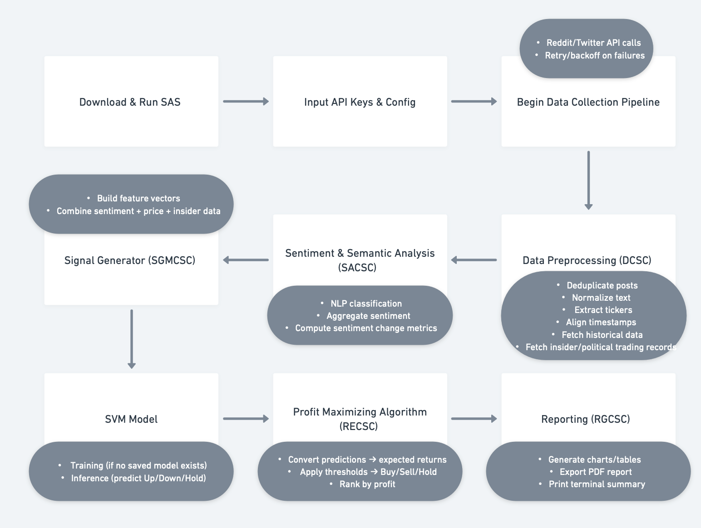
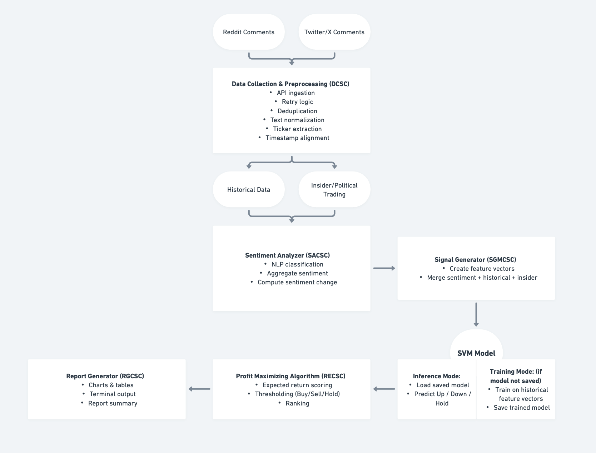

# SDL

## SDD

# 2.0 Software Design Description (SDD)
## 2.1 Introduction
This document presents the architectural design of the Stock Analysis System (SAS). The purpose of this section is to define the system’s high-level structure, the major software components, and the interactions between them as they implement the functional requirements in the SRS.

SAS is a terminal-based analytics system that collects social-media sentiment (Reddit/Twitter), historical stock data, and insider or political trading disclosures (SRS §1.3.2, §1.3.3). It transforms these data into feature vectors, applies a Support Vector Machine (SVM) model (SRS §1.3.4), and uses a Profit Maximizing Algorithm to produce Buy/Sell/Hold recommendations (SRS §1.3.5). Results are exported to PDF and printed in the terminal (SRS §1.3.6).

This Architectural Design section defines:
- The major subsystems (CSCs) and their relationships
- The data flow across layers
- The external interfaces used
- UML-style diagrams

--- 

## 2.1.1 System Objectives
The objectives of the SAS are to:
1. Automate scraping of social-media sentiment (FR 1.3.2.1-1.3.2.3).
2. Aggregate sentiment into stock-level metrics (FR 1.3.3.3).
3. Combine sentiment with historical and insider trading data (FR 1.3.2.4, 1.3.2.5, 1.3.4.1).
4. Train and run an SVM model to classify expected movement (FR 1.3.4.4-1.3.4.7).
5. Convert predictions into Buy/Sell/Hold recommendations (FR 1.3.5.1-1.3.5.5).
6. Produce visual and tabular PDF reports (FR 1.3.6.1-1.3.6.7).

These objectives drive the system’s layered architecture.

---
## 2.1.2 Hardware, Software, and Human Interfaces
 ### 2.1.2.1 Hardware Interfaces
- Standard personal computing hardware ( ≥ 8GB RAM, 2.0 GHz CPU ).
- Local file system for PDF output.
- Internet connection for API access.

### 2.1.2.2 Software Interfaces
- APIs: 
   - Reddit API (HTTPS, JSON) (FR 1.3.2.1)
   - Optional Twitter API  (FR 1.3.2.2)
   - Market data provider (e.g., yfinance or AlphaVantage) (FR 1.3.2.4)
   - Insider trading dataset (CSV or REST endpoint) (FR 1.3.2.5)
- Python Libraries:
PRAW, Pandas, scikit-learn, Matplotlib, ReportLab, NLTK/TextBlob.
- OS: macOS, Windows, Linux.

### 2.1.2.3 Human Interfaces
- Terminal input (interactive + config file mode) (FR 1.3.1.2 & 1.3.1.3)
- Terminal output summary (FR 1.3.6.7)
- PDF report (FR 1.3.6.5-1.3.6.6)
---

## 2.2 Architectural Design
SAS uses a 5-layered architecture, chosen for:
- Separation of concerns: Sentiment, data ingestion, ML modeling, and reporting are isolated.
- Testability: Each layer can be unit-tested independently (especially SACSC and SGMCSC).
- Extensibility: New data sources (e.g., Reddit → Twitter) can be added without modifying other layers.
- Performance control: Heavy computation (SVM) is isolated from I/O-bound tasks (APIs).

This approach aligns with industry layered-architecture patterns and directly supports the SRS requirement decomposition.

--- 

### 2.2.1 Major Software Components
Each major component corresponds directly to CSCs defined in the SRS.

---

#### 1. Data Collection Component (DCSC)
- Implements: SRS §1.3.2 and §1.4.1
- Responsibilities:
   - Connect to social-media APIs (Reddit/Twitter)
   - Download posts/comments
   - Remove duplicates, normalize encoding, extract tickers
   - Fetch historical data (prices)
   - Import insider/political trades
   - Align social media, historical, and insider timelines
- Inputs:
   - Subreddit/Twitter query
   - API keys
   - User configuration (FR 1.3.1.2-1.3.1.3)
- Outputs:
   - Structured datasets:
      - Social media sentiment input table
      - Historical OHLC/volume table
      - Insider trade records
- Boundary Clarification:
   - Error recovery (retry/backoff) is handled inside DCSC (FR 1.4.1.2).
   - DCSC does not compute sentiment, that belongs to SACSC.

---

#### 2. Sentiment & Semantic Analysis Component (SACSC)
- Implements: SRS §1.3.3
- Responsibilities:
   - Apply NLP classifier per comment/post
   - Associate sentiment with tickers and timestamps
   - Aggregate sentiment into daily/weekly windows
   - Compute sentiment change (delta, % change)
   - Identify extreme positive/negative movers
- Inputs:
   - Cleaned text from DCSC
   - Extracted ticker list
- Outputs:
   - Ticker-level sentiment table
   - Sentiment change metrics
- Boundary Clarification:
   - Does not access external APIs
   - Does not generate ML features (that is SGMCSC)

---

#### 3. Signal Generation & Modeling Component (SGMCSC)
- Implements: SRS §1.3.4 and §1.4.3
- Responsibilities:
   - Combine sentiment + price + insider data into feature vectors
   - Enable/disable features via configuration
   - Train SVM model (train/validate/test)
   - Persist model
   - Run inference
- Inputs:
   - Sentiment metrics
   - Historical stock features
   - Insider trading flags
- Outputs:
   - Predicted movement classes (Up/Down/Hold)
   - Saved SVM model file
- Boundary Clarification:
   - Does not compute profit-maximizing scores (RECSC handles that)

---

#### 4. Recommendation Engine Component (RECSC)
- Implements: SRS §1.3.5 and §1.4.4
- Responsibilities:
   - Convert SVM output into expected returns
   - Rank stocks using Profit Maximizing Algorithm
   - Apply threshold-based Buy/Sell/Hold classification
- Inputs:
   - Movement probabilities
   - Confidence values
   - Configurable thresholds
- Outputs:
   - List of Buy/Sell/Hold recommendations
   - Explanation of contributing features (FR 1.3.5.6)

---

#### 5. Report Generation Component (RGCSC)
- Implements: SRS §1.3.6 and §1.4.5
- Responsibilities:
   - Generate charts for sentiment & predicted movers
   - Construct tables of metrics and predictions
   - Export PDF
   - Print CLI summary
- Inputs:
   - Recommendation results
   - Sentiment and model outputs
Outputs:
   - PDF report
   - Terminal summary output

---

### 2.2.2 Major Software Interactions
#### Overall Data Flow

1. DCSC → SACSC:
Format: in-memory Pandas DataFrame with cleaned text, tickers, timestamps

2. SACSC → SGMCSC:
   - Format: numeric sentiment metrics DataFrame
3. DCSC (historical + insider) → SGMCSC:
   - Format: OHLCV price matrix + insider trade table
4. SGMCSC → RECSC:
   - Format: dictionary or DataFrame with predicted classes & confidence
5. RECSC → RGCSC:
   - Format: recommendation table with Buy/Sell/Hold and scores

---

#### External Interactions
- Reddit/Twitter APIs via HTTPS JSON
- Market data provider via REST or Python client
- Insider/Politician trades via CSV or REST JSON
- Local filesystem for model persistence and PDF output

---

#### Error Handling & Edge-Case Interactions
- If Reddit or Twitter API fails → retry with exponential backoff (FR 1.4.1.2)
- If historical data is missing → skip ticker or mark unavailable
- If insider trade dataset is incomplete → set insider-flag = 0
- If SVM model file missing → trigger auto-retrain

---

### 2.2.3 Architectural Design Diagrams

#### 2.2.3.1 System Workflow Diagram

---

#### 2.2.3.2 Data Flow / Component Diagram

