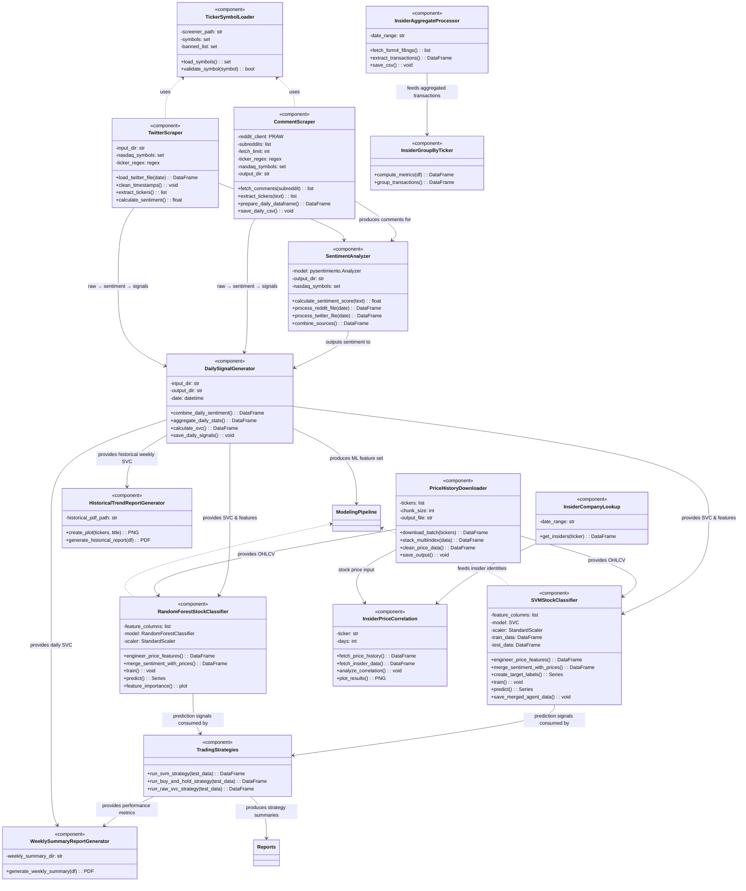

# SDL

## SDD

# 2.3 CSC AND CSU DETAILED DESCRIPTIONS

This section provides the detailed design for all Computer Software Components (CSCs) and Computer Software Units (CSUs) comprising the **Stock Analysis System (SAS)** CSCI. Each module in the codebase is represented as a logical class, satisfying the SDD requirement that CSUs be described in class-level detail, including fields, methods, internal data structures, and interactions.

The CSUs in this section directly implement the functional requirements specified in SRS Sections **1.3.2-1.3.6** (Data Collection, Sentiment Analysis, Signal Generation, Modeling, Recommendations, Reporting).

---

## 2.3.1 Detailed Class Descriptions

The following subsections describe each CSU as a logical class.  
Each class includes:

- Purpose 
- Fields / internal state 
- Methods with full explanations 
- Inputs and outputs  
- Interactions with other CSUs  
- Mapping to SRS Requirements

Classes are grouped by their parent CSC as defined in the architecture.

---

## 2.3.1.A DATA COLLECTION CSC

This CSC satisfies SRS 1.3.2 Data Collection Requirements -retrieving social media posts, insider data, historical prices, and preparing structured datasets.

---

### 2.3.1.1 Class: `TickerSymbolLoader`  
**Implements:** SRS 1.3.2.1, 1.3.2.8  
**Source Module:** `comment_scraper.py`, `sentiment_analyzer.py`, `download_price_history.py`

#### Purpose
Loads and validates the complete NASDAQ ticker list used across all modules to find stock mentions.

#### Fields
| Field | Description |
|-------|-------------|
| `screener_path` | File path to `nasdaq_screener.csv` |
| `symbols` | Set of validated ticker symbols |
| `banned_list` | Words to exclude from detection (e.g., IT, FOR, AI) |

#### Methods
- `load_symbols()`  
  Reads the CSV, extracts valid uppercase tickers, removes banned terms.  
  **Output:** `set[str]` of symbols.

- **`validate_symbol(symbol)`**  
  Returns `True` if symbol is in NASDAQ set.

#### Interfaces
Used by **CommentScraper**, **TwitterSentimentProcessor**, and **SentimentAnalyzer**.

---

### 2.3.1.2 Class: `CommentScraper`  
**Implements:** SRS 1.3.2.1, 1.3.2.3, 1.3.2.6, 1.3.2.7  
**Source Module:** `comment_scraper.py`

#### Purpose
Scrapes Reddit comments from multiple financial subreddits, extracts tickers, filters noise, and stores all relevant comments.

#### Fields
| Field | Description |
|-------|-------------|
| `reddit_client` | PRAW instance authorized with credentials |
| `subreddits` | List of subreddits to fetch from |
| `ticker_regex` | Regex used to detect stock tickers |
| `nasdaq_symbols` | Set of valid tickers loaded by TickerSymbolLoader |
| `banned_list` | List of capitalized words excluded from ticker parsing |
| `output_dir` | Folder for storing daily comment CSVs |
| `fetch_limit` | Maximum number of comments per subreddit |

### Methods
- `fetch_comments(subreddit)`  
  Streams comments using Reddit API; filters by recent timestamps.

- `extract_tickers(text)` 
  Regex-based detection; cross-references NASDAQ list; removes false positives.

- `prepare_daily_dataframe()`  
  Explodes multi-ticker comments, standardizes column names.

- `save_daily_csv()`  
  Writes annotated comments to `daily_comments/<date>.csv`.

#### Outputs
A normalized CSV with columns:  
`timestamp, comment_id, comment_body, ticker, subreddit`

---

### 2.3.1.3 Class: `TwitterScraper`  
**Implements:** SRS 1.3.2.2, 1.3.2.3  
**Source Module:** `sentiment_analyzer.py`

#### Purpose
Loads daily tweet files, parses timestamps, extracts tickers, calculates sentiment.

#### Fields
| Field | Description |
|-------|-------------|
| `input_dir` | Path to daily tweet dump |
| `nasdaq_symbols` | Valid ticker list |
| `ticker_regex` | Regex for ticker parsing |

### Methods
- `load_twitter_file(date)` - Reads raw tweet CSV.  
- `clean_timestamps()` - Uses strict Twitter timestamp format.  
- `extract_tickers()` - Same logic as CommentScraper.  
- `calculate_sentiment()` - Delegates to SentimentAnalyzer.

#### Outputs
Normalized CSV:  
`timestamp, ticker, sentiment_score, source, text`

---

### 2.3.1.4 Class: `PriceHistoryDownloader`  
**Implements:** SRS 1.3.2.4  
**Source Module:** `download_price_history.py`

### Purpose
Downloads and preprocesses full historical OHLCV data for all NASDAQ tickers from 2008-present.

### Fields
| Field | Description |
|-------|-------------|
| `tickers` | List of NASDAQ symbols |
| `chunk_size` | Download batch size |
| `output_file` | Historical CSV path |

### **Methods**
- `download_batch(tickers)` - Calls yfinance.  
- `stack_multiindex()` - Flattens OHLCV multiindex.  
- `clean_price_data()` - Removes invalid rows (NaN, zero).  
- `save_output()`

### Outputs
`historical_prices.csv`

---

### 2.3.1.B SENTIMENT & SEMANTIC ANALYSIS CSC

Fulfills SRS 1.3.3.

---

### 2.3.1.5 Class: `SentimentAnalyzer`  
**Implements:** SRS 1.3.3.1, 1.3.3.2  
**Source Module:** `sentiment_analyzer.py`

### Purpose
Uses `pysentimiento` to compute sentiment scores for Reddit and Twitter content.

### Fields
| Field | Description |
|-------|-------------|
| `model` | Tweet sentiment analyzer |
| `nasdaq_symbols` | Used to re-detect tickers in tweets |
| `output_dir` | Where daily sentiment CSVs are saved |

### Methods
- `calculate_sentiment_score(text)`  
  Maps POS + NEU/2 - 0.5 → continuous score ∈ [-0.5, +1].

- `process_reddit_file(date)`  
  Loads comment CSV, adds sentiment.

- `process_twitter_file(date)`  
  Extracts tickers, scores sentiment.

- `combine_sources()`  
  Standardizes fields across platforms.

### Outputs
`daily_sentiment/<date>.csv`  
Fields: `timestamp, ticker, sentiment_score, source, text, comment_id`

---

### 2.3.1.C SIGNAL GENERATION CSC

Implements SRS 1.3.3-1.3.4.

---

### 2.3.1.6 Class: `DailySignalGenerator`  
**Implements:** SRS 1.3.3.3-1.3.3.6  
**Source Module:** `daily_signal_generator.py`

### Purpose
Aggregates daily sentiment signals and computes SVC (Sentiment Volume Change) metric.

### Fields
| Field | Description |
|-------|-------------|
| `input_dir` | Location of daily sentiment files |
| `output_dir` | Where signals will be written |
| `date` | Processing date |

### Methods
- `combine_daily_sentiment()`  
  Loads all `YY-MM-DD.csv` sentiment files.

- `aggregate_daily_stats()`  
  Groups by ticker + day → mean sentiment, comment volume.

- `calculate_svc()`  
  Computes:  
  - `sentiment_change = Δ mean_sentiment`  
  - `volume_change = |Δ comment_count|`  
  - `svc = sentiment_change × volume_change`

- `save_daily_signals()`

### Outputs
`daily_signals/<date>_signals.csv`  
Columns include:  
`mean_sentiment, comment_count, sentiment_change, volume_change, svc`

---

# 2.3.1.D MODELING CSC

Satisfies SRS 1.3.4.

---

### 2.3.1.7 Class: `SVMStockClassifier`  
**Implements:** SRS 1.3.4.1-1.3.4.7  
**Source Module:** `svm_stock_classifier.py`

### Purpose
Trains an SVM using engineered sentiment + price features.

### Fields
| Field | Description |
|-------|-------------|
| `feature_columns` | List of engineered features |
| `model` | scikit-learn SVC model |
| `scaler` | StandardScaler instance |
| `train_data`, `test_data` | Split datasets |

### Methods
- `engineer_price_features()` - Computes 1d, 1w, 1m… returns.  
- `merge_sentiment_with_prices()`- Inner join on ticker, date.  
- `create_target_labels()`- 5-class movement labeling.  
- `train()` 
- `predict()`  
- `save_merged_agent_data()`

---

### 2.3.1.8 Class: `RandomForestStockClassifier`  
**Implements:** SRS 1.3.4.1-1.3.4.7  
**Source Module:** `randomForest.py`

### Purpose
Trains a 500-tree Random Forest model using same feature set.

### Methods
Same as SVM, except includes:

- `feature_importance()` → matplotlib plot

### Outputs
- Prediction vector  
- Feature importance chart  
- Backtesting-ready dataframe

---

### 2.3.1.E RECOMMENDATION & STRATEGY CSC

Implements SRS 1.3.5.

---

### 2.3.1.9 Class: `TradingStrategies`  
**Source Module:** `trading_strategies.py`

### Purpose
Implements three portfolio-level backtesting strategies.

### Methods
- `run_svm_strategy()`  
  Uses SVM’s predicted class to buy/sell 10% increments.

- `run_buy_and_hold_strategy()`  
  Benchmarks against passive strategy.

- `run_raw_svc_strategy()`
  Trades based solely on SVC thresholds.

### Outputs
Metrics per ticker:  
`profit, final_value, risk_pct, sharpe_ratio, total_return_pct`

---

### 2.3.1.F INSIDER DATA CSC

Implements **SRS extensions** for insider-based features.

---

### 2.3.1.10 Class: `InsiderAggregateProcessor`  
**Source:** `insider_aggregate.py`

### Purpose
Fetches all Form 4 filings in a date range; extracts buy/sell events.

---

### 2.3.1.11 Class: `InsiderGroupByTicker`  
**Source:** `group_by_ticker.py`

### Purpose
Computes metrics such as:  
- total purchase transactions  
- total sale transactions  
- buy/sell ratio

---

### 2.3.1.12 Class: `InsiderCompanyLookup`  
**Source:** `insider_company.py`

### Purpose
Finds all insiders (names + roles) for a given ticker across 6 months.

---

### 2.3.1.13 Class: `InsiderPriceCorrelation`  
**Source:** `Price_correlation.py`

### Purpose
Plots insider buys/sells against closing price.

---

### 2.3.1.G REPORT GENERATION CSC

Implements SRS 1.3.6.

---

### 2.3.1.14 Class: `WeeklySummaryReportGenerator`  
**Source:** `generate_report.py`

### Purpose
Computes weekly aggregates using SVC metrics and generates PDF.

---

### 2.3.1.15 Class: `HistoricalTrendReportGenerator`  
**Source:** `generate_report.py`

### Purpose
Creates multi-week sentiment trend plots + AI-generated summary.

---

## 2.3.2 DETAILED INTERFACE DESCRIPTIONS

Interfaces describe data transfers between CSUs.

### Interface 1: CommentScraper → SentimentAnalyzer
- **Format:** CSV  
- **Fields:** `timestamp, ticker, comment_body, subreddit`

### Interface 2: SentimentAnalyzer → DailySignalGenerator
- CSV with `sentiment_score`, `ticker`, `timestamp`

### Interface 3: PriceHistoryDownloader → Classifiers
- OHLCV table keyed by ticker/date

### Interface 4: DailySignalGenerator → Classifiers
- Includes engineered features:  
  `mean_sentiment, sentiment_change, volume_change, svc`

### Interface 5: Classifiers → TradingStrategies
- Columns: `ticker, date, signal, change_day, features…`

### Interface 6: TradingStrategies → ReportGenerator
- Summary metrics for each strategy

### Interface 7: Insider CSUs → Modeling
- Insider-derived features can be integrated into ML pipeline

---

## 2.3.3 DETAILED DATA STRUCTURE DESCRIPTIONS

### 1. Social Media Record
| Field | Type | Description |
|-------|------|-------------|
| timestamp | datetime | Comment/tweet time |
| text | string | Body text |
| ticker | string | Parsed ticker |
| comment_id | string | Unique identifier |
| source | enum | reddit/twitter |

---

### 2. Sentiment Structure
| Field | Description |
|-------|-------------|
| mean_sentiment | Avg sentiment per ticker/day |
| sentiment_score | Individual comment score |

---

### 3. Price Structure
| Field | Description |
|-------|-------------|
| date | Trading day |
| ticker | Symbol |
| open/high/low/close | OHLC prices |
| volume | Trading volume |

---

### 4. SVC Feature Structure
| Feature | Description |
|---------|-------------|
| sentiment_change | Δ sentiment |
| volume_change | Δ comment frequency |
| svc | sentiment_change × volume_change |

---

### 5. ML Feature Vector Structure
Includes:  
`change_day, change_week, change_month...`,  
`mean_sentiment`, `comment_count`, `sentiment_change`, `volume_change`, `svc`

---

### 6. Strategy Output Structure
| Field | Description |
|-------|-------------|
| final_value | Ending portfolio value |
| profit | Absolute profit |
| total_return_pct | Percent return |
| risk_pct | Std dev of daily returns |
| sharpe_ratio | Risk-adjusted return |

---

## 2.3.4 DETAILED DESIGN DIAGRAMS

### Class Diagram

---

### Footnote: Notes on Tooling, AI Assistance, and Code Evolution

#### A.1 Use of AI-Assisted Tools
Parts of this Software Design Document (SDD), including the generation of UML diagrams, structural descriptions, formatting refinements, and narrative clarification, were produced with the assistance of AI-based tools (ChatGPT and similar diagram-generation utilities).  
All architectural decisions, system logic, component definitions, and implementation details reflect our design and development work; AI assistance was used strictly for drafting, structuring, and improving clarity in documentation.

#### A.2 Tentative Code Syntax and Future Changes
All referenced classes, modules, methods, variable names, and data structures included in the SDD reflect the state of the project at the time of writing. Because active development is ongoing, these identifiers are **subject to change in future commits**.  

#### A.3 Disclaimer on Diagram Accuracy
The UML diagrams, including class diagrams, sequence diagrams, activity diagrams, component diagrams, and deployment diagrams, represent an accurate mapping of the system’s logical structure as of the current version.  
However, as implementation evolves, diagram elements may deviate from the final codebase.

---

*End of Footnote*

