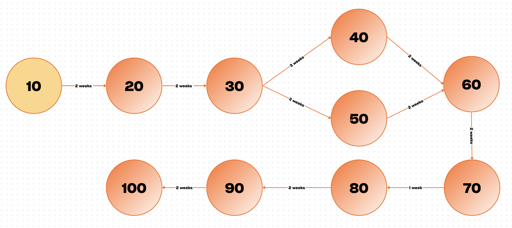

# SDL

## SDP

# 4.1 Plan Introduction

This Software Development Plan (SDP) describes the structured development process for the **Stock Analysis System (SAS)**, a sentiment-driven stock-analysis pipeline that identifies trending stocks from social media, cross-references them with historical market behavior and political insider-trading data, and outputs **Buy**, **Sell**, or **Hold** recommendations. The SAS is built as an end-to-end automated analysis engine designed for research, experimentation, and demonstration.

The SAS will ingest real-time social-media data, compute sentiment-volume metrics, score candidate stocks, and augment those results through third-party APIs (market-history API, political insider-trading API). The system will then generate a recommendation summary and optional Autopilot action. Development activities include requirements modeling, system specification, design, implementation, testing, integration, documentation, and final demonstration.

Tentative milestone dates:
- **ConOps:** Completed Week 3  
- **SRS:** Completed Week 6  
- **SDD:** Week 9  
- **Alpha Demonstration:** Week 13   
- **Final Delivery & Showcase:** Week 15  

---

## 4.1.1 Project Deliverables

Below are all deliverables that will be submitted to the instructor, along with a description of each item:

- **Concept of Operations (ConOps)**  
  Provides a high-level operational overview of SAS, user stories, workflows, and functional context.

- **Software Requirements Specification (SRS)**  
  Fully defines system requirements, functional/non-functional constraints, sentiment metrics, scoring rules, API usage, and Autopilot behavior.

- **Software Design Document (SDD)**  
  Contains architecture diagrams, class diagrams, module interfaces, data-flow details, preprocessing and ML sentiment pipelines, and component-level design.

- **Software Development Plan (SDP)**  
  (This document.) Outlines resources, schedule, tasks, and development procedures to complete SAS.

- **Instantiating**  
  Includes API selection, stress testing, and validation of buy/sell recommendation correctness.

- **ABCDR Demonstration**  
  Nearly functional system showing full pipeline integration, structured outputs, and stable processing.

- **Final System Delivery**  
  Delivery of all source code, documentation, and fully running SAS demonstration on the Clovux server.

- **Final Poster Presentation**  
  Professional poster summarizing the system architecture, algorithms, testing, and results.

---

# 4.2 Project Resources

## 4.2.1 Hardware Resources

The following hardware will be used for development, testing, and deployment:

- **Developer Machines (MacBook / Windows PC)**  
  Used for coding, testing, documentation, version control, and local experiments.

- **Clovux Private Server**  
  - Hosts real-time SAS sentiment scanner  
  - Runs Python services (Flask/FastAPI)  
  - Executes scheduled jobs and Autopilot tasks  
  - Stores logs and cached data  
  Specs include:  
  - 4 vCPUs  
  - 8 GB RAM  
  - 80 GB SSD storage  

- **Optional External Database Host (Cloud/Postgres)**  
  Used if the team decides to store long-term sentiment snapshots or insider-trading history.

No specialized GPU hardware is required, as SAS sentiment analysis uses lightweight LLM/API inference and classical models (SVC, Random Forest) rather than deep learning.

---

## 4.2.2 Software Resources

The SAS project uses the following software tools:

- **Programming Languages**  
  - Python 3.10 (primary pipeline, APIs, algorithms)
  - Bash (deployment)

- **APIs**  
  - Reddit/Twitter/X sentiment ingestion API  
  - Market historical data API (e.g., Yahoo Finance, Polygon.io)  
  - Political insider-trading API (e.g., QuiverQuant)  

- **Python Libraries**  
  - `PySentimiento` - LLM-powered sentiment processing  
  - `Pandas` - data cleaning and scoring  
  - `Scikit-learn` - SVM + Random Forest models  
  - `Requests` - API communication  
  - `Matplotlib/Seaborn` - debugging plots  

- **Development Tools**  
  - VS Code  
  - Git + GitHub  
  - Virtual environments  
  - Markdown + LaTeX tools for documentation  

- **Server Software**  
  - Ubuntu Linux    

---

# 4.3 Project Organization / Human Resources

| Team Member | Responsibilities |
|-------------|-----------------|
| Abdullah | SRS, SDD, ConOps, SDP, demonstrations, debugging  |
| Akash | Market-data integration, Autopilot, testing framework  |
| Rayane | Sentiment pipeline, API integration, Autopilot, testing framework |
| Stanley | Market-data integration, insider-trading parsing, scoring model |

---

# 4.4 Schedule

This section provides the overall schedule information for the SAS project. Tasks proceed in a linear-plus-iterative flow, with overlap where appropriate.

Subsections provide detailed breakdowns of task ordering and resource usage.

---

## 4.4.1 PERT / GANTT Chart

### PERT Chart Description

- (10) Start
- (20) Requirements
- (30) Sentiment Engine
- (40) Market API
- (60) Recommendation Engine
- (70) Integration & Testing
- (80) Alpha Demo
- (90) Final Poster Presentation
- (100) Final Delivery

### PERT Critical Path Table 

| Node Number | Node Description | Duration | Path |
|-------------|------------------|----------|----------|
| 10 | Project Start | - | Critical |
| 20 | Requirements Finalization | 2 weeks |Critical |
| 30 | Sentiment Engine Development | 3 weeks |Critical |
| 40 | Market Data API Integration | 2 weeks |Critical |
| 50 | Insider-Trading API Integration | 2 weeks |Critical |
| 60 | Recommendation Engine Assembly | 1 week |Critical |
| 70 | Integration & Testing | 2 weeks |Critical |
| 80 | Alpha Demonstration | 1 week |Critical |
| 90 | Final Poster Presentation | 2 weeks |Critical |
| 100 | Final Delivery| 1 week |Critical |

---

## 4.4.2 Task / Resource Table

| Task | People | Hardware | Software |
|------|--------|----------|----------|
| Sentiment Engine | Rayane | Dev Laptop, Server | Python, PySentimiento |
| API Integrations | Stanley, Akash | Dev Laptop, Server | Requests, Pandas |
| Scoring Model | Rayane | Dev Laptop | Scikit-learn |
| Autopilot Mode | Akash | Server | Python, Scheduler |
| Documentation | Abdullah | Any | Markdown, VS Code |
| Deployment | All | Server | Nginx, Bash |

---

## 4.4.3 Class Schedule (Optional)

| Week | Activity |
|------|----------|
| Week 3 | ConOps / Proposal Presentation |
| Week 6 | SRS Delivery |
| Week 9 | SDD Delivery |
| Week 13 | ABCDR Demo |
| Finals Week | Final Project Presentation |

---

# Table of Contents 

- 4.1 Plan Introduction  
- 4.1.1 Deliverables  
- 4.2 Project Resources  
- 4.2.1 Hardware  
- 4.2.2 Software  
- 4.3 Project Organization  
- 4.4 Schedule  
- 4.4.1 PERT/Gantt  
- 4.4.2 Task/Resource Table  
- 4.4.3 Class Schedule  

---  
  
*Footnote: Portions of this document were drafted with the assistance of AI tools for clarity and organization. All final content, decisions, and project details were written and reviewed by the development team.*

